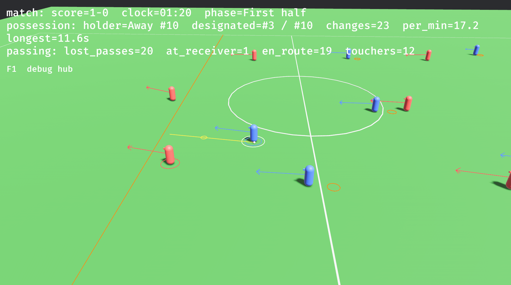

# Simulador de fútbol

Simulador **causal** de fútbol asociación, escrito en Rust sobre [Bevy](https://bevyengine.org/).
No es un videojuego ni el port de uno: es una plataforma para reproducir
situaciones, comparar decisiones alternativas y explicar por qué ocurre lo que
ocurre en el campo.

Qué espacio debía proteger un jugador, qué información podía tener, qué carreras
eran alcanzables y qué riesgo crea cada alternativa. El norte completo, con sus
ocho principios y los MVP, está en [`docs/NORTE.md`](docs/NORTE.md).



## Estado actual: no lo uses como predicción

Hay kernel autoritativo, escenarios reproducibles, reloj con sus periodos,
árbitro que pita, cuerpos con motor y fatiga, y jugadores que deciden con lo
que ven y no con la verdad del mundo.

Lo que todavía no está: **demasiados tiros acaban en gol**, y de ahí un ritmo
que no es el de un partido de verdad. Hasta calibrar —un hito posterior, cuando
existan los mecanismos que lo producen— ningún resultado de aquí puede
presentarse como predicción de nada. El trabajo activo y la deuda declarada
están en [`docs/AHORA.md`](docs/AHORA.md).

## Cómo se ejecuta

Requiere Rust estable ≥ 1.97 (edición 2024) y las dependencias de sistema de
Bevy para tu plataforma.

```bash
cargo run                 # el partido con ventana
cargo test -p gameplayfootball -p gameplayfootball_{domain,simulation,presentation}
cargo clippy --all-targets --all-features -- -D warnings
```

Los cuatro paquetes se nombran porque dentro del workspace compartido `cargo
test` a secas sólo alcanza el paquete raíz, y `--workspace` compila los demás
juegos que viven allí.

Con la ventana abierta, `F1` abre el hub de depuración: overlays y canales de
log, todos apagados por defecto. Sin ventana, la misma situación corre headless
con `ScenarioRunner::headless` y se observa por hechos, ledger y campo en ASCII
([`docs/DIAGNOSTICS.md`](docs/DIAGNOSTICS.md)).

### Medir, no mirar

La simulación es determinista pero caótica: una sola corrida es una
trayectoria, no una métrica. La comparación válida entre dos builds es la
envolvente sobre semillas:

```bash
cargo test --release -p gameplayfootball_simulation seeded_envelope -- --ignored --nocapture
```

Diez semillas de diez minutos, reportadas como tasas. Para mirar una corrida en
detalle está `long_match_stats`, con las mismas banderas; y para responder una
pregunta concreta sobre el juego, `cargo run -p gameplayfootball_simulation
--bin probe` lista las sondas, que anexan lo que miden a
`measurements/probes.csv`.

### Fuera del workspace `uneven`

El proyecto se desarrolla como miembro de un workspace Cargo mayor que no viaja
en este repositorio: varios juegos comparten allí un `Cargo.lock` y los
artefactos de compilación, que en Bevy pesan demasiado para duplicarlos. Los
cuatro manifiestos no heredan nada de él, así que un clon compila y arranca tal
cual (`cargo run`).

Lo que le falta al clon es ser workspace de sí mismo —sin eso `crates/*` no son
miembros y `cargo test -p ...` no los encuentra—. Se arregla añadiendo al final
de `Cargo.toml` un `[workspace]` con `members = ["crates/domain",
"crates/presentation", "crates/simulation"]`, y un `[profile.dev]` con
`opt-level = 1` y `3` para `package."*"`: Bevy sin optimizar las dependencias es
intratable, y sus símbolos de depuración no se depuran nunca, así que ese perfil
lleva también `debug = false` en las dependencias. No está commiteado porque
dentro de `uneven` Cargo rechaza que un miembro sea a la vez raíz de otro
workspace.

### En Linux con Wayland

Si el compositor da problemas, `env -u WAYLAND_DISPLAY
./target/debug/gameplayfootball` fuerza XWayland.

## Estructura

Cuatro capas, y las fronteras las impone Cargo y no la revisión de código:
`crates/domain` (tipos, unidades, reglas), `crates/simulation` (el kernel
autoritativo: física, decisión, táctica, arbitraje y telemetría),
`crates/presentation` (visuales, cámara, UI, overlays; solo lee) y `src/` (la
app: composición, escenarios y ciclo de vida).

Las dos de abajo no dependen de `bevy` sino de sus subcrates, así que no pueden
nombrar un mesh ni enlazar el renderer, y borrar `crates/presentation` deja un
partido completo jugable por máquina. Las leyes y las dependencias permitidas
están en [`docs/ARCHITECTURE.md`](docs/ARCHITECTURE.md).

## Documentación

En `docs/`: [`NORTE.md`](docs/NORTE.md) (producto y MVP),
[`ARCHITECTURE.md`](docs/ARCHITECTURE.md) (las leyes),
[`AHORA.md`](docs/AHORA.md) (el trabajo activo),
[`DOMAIN_MODEL.md`](docs/DOMAIN_MODEL.md),
[`LAWS_OF_FOOTBALL.md`](docs/LAWS_OF_FOOTBALL.md),
[`VALIDATION.md`](docs/VALIDATION.md) y
[`DIAGNOSTICS.md`](docs/DIAGNOSTICS.md). La historia está en `git log` y las
cifras en `measurements/`, no en prosa. `docs/references/gameplay_football/`
guarda la documentación histórica del port; [`AGENTS.md`](AGENTS.md) es lo
mismo condensado para agentes de código.

## Linaje y licencia

El proyecto empezó como port de [Gameplay Football](https://github.com/BazkieBumpercar/GameplayFootball)
(C++), que sigue siendo referencia técnica —igual que Google Research Football—
pero no la especificación: ninguna decisión se justifica hoy diciendo que el
original lo hacía así.

GNU General Public License v3.0 o posterior, texto completo en
[`LICENSE`](LICENSE). Se distribuye con la esperanza de que sea útil pero SIN
NINGUNA GARANTÍA; ni siquiera la garantía implícita de COMERCIABILIDAD o
APTITUD PARA UN PROPÓSITO PARTICULAR.
